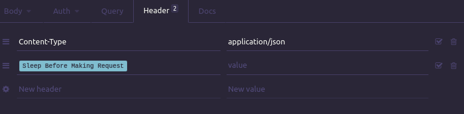
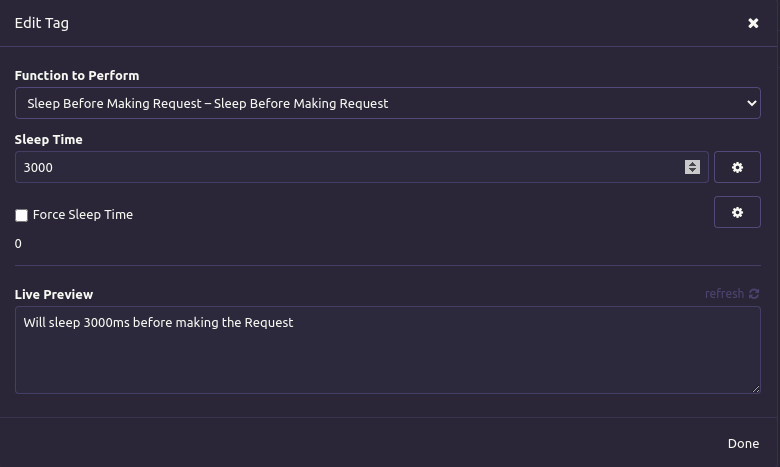

# Insomnia Plugin Sleep Before Request

Configure a sleep time in milliseconds before making a request. 

It's usefull in case of request chaining that need to await backends services to process the previos requests.

## Installation

Install the `insomnia-plugin-sleep-before-request` plugin from Preferences > Plugins.

## How to Use It

Start by adding a custom request header to a request that you want to implement a sleep time before making the request.

You need to input the sleep time, a number of milliseconds.

The plugin will only allow to input a sleep time lower then 5 seconds(5000 milliseconds) if you want more then this you need to check Force Sleep Time.

